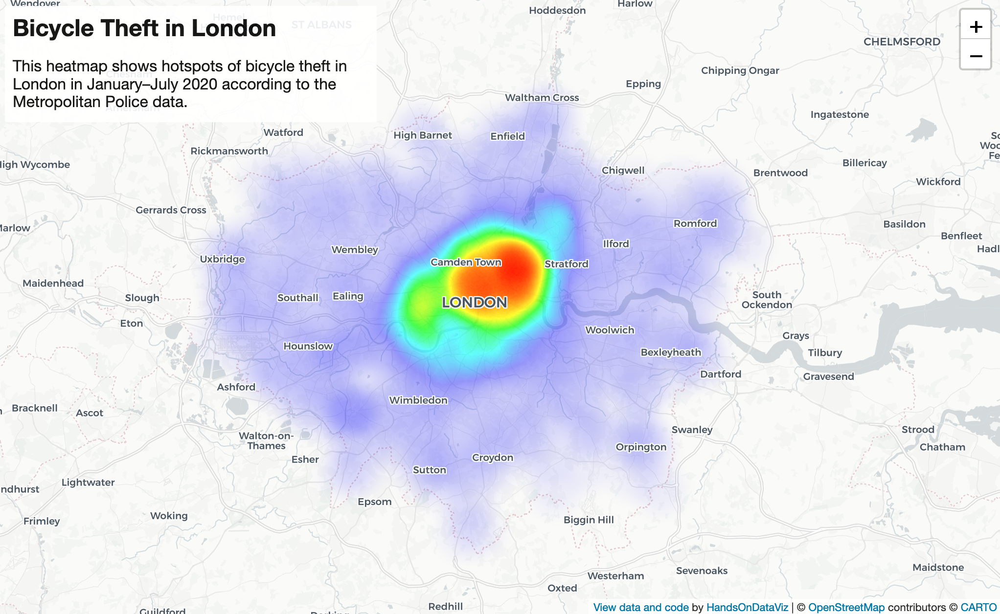

# SkyNet-visualization protoype 

This map is constructed by leaflet.js [Leaflet.Heat](https://github.com/Leaflet/Leaflet.heat).



## How it works...

SkyNet is a project that filtrates the data from the elections in Chile and georeferences the houses
of the people who have more probability to vote for X candidate. When the data is filtrated, this template shows the results.

## Not everything is rainbow color

The electoral role at mids 2021 worked that a person in X commune
(comuna) is assigned a random place to vote in the commune
. This created the effect of homogeneous visualization when the maps were created. So at the moment, the visualization can not contribute extra information.
 
Regardless of this fact, Recently (in 2021) a law was promulgated that the places the voters vote are the nearest places from their home. This can create interesting tendencies for future elections. 

## A glimpse of how it works 

data.csv store all the data from all the persons that have an X% of voting for Y Candidate, then this vector of information is displayed in the map.

```
-33.447604,-70.672861,SANTIAGO,EL CENTRO,131 V
-33.437971,-70.656535,SANTIAGO,EL CENTRO,131 V
-33.454494,-70.63261,SANTIAGO,PARQUE ALMAGRO,131
```

For more information on customization, see [Leaflet documentation](https://leafletjs.com/).